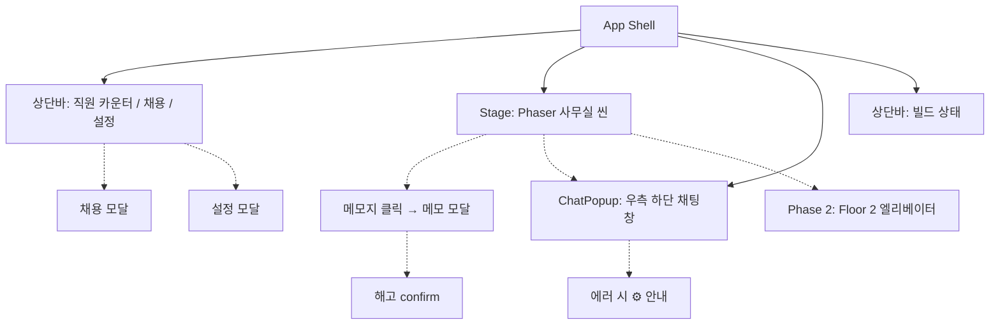

# PixelAgentOffice — Product Requirements Document

> **"AI 에이전트를 픽셀 직원처럼 채용·관리하는 게임형 데스크탑 앱"**

| 항목 | 내용 |
|---|---|
| **프로젝트 명** | PixelAgentOffice |
| **유형** | 데스크탑 앱 (Electron) · 개인 학습/포트폴리오 |
| **기간** | 2026-05-12 ~ 진행 중 (3일 차) |
| **상태** | M3 코드 완성 — 다중 LLM 연결, E2E 테스트 셋업, 비즈니스 모델 검증 단계 |
| **읽는 시간** | ☕ 8~10분 (skim 3분) |
| **저장소** | private — 코드/기획/시안 일체 보관 |
| **시안** | [wireframes-v2.html](visuals/wireframes-v2.html) · [office-mockup.html](visuals/office-mockup.html) |

---

## 📌 30초 요약

AI 에이전트는 강력하지만 **일반 사용자에겐 진입 장벽이 너무 높다**. 코드, 터미널, JSON 설정, 추상적 오케스트레이션 개념. 그런데도 많은 일반 사용자가 ChatGPT/Claude 앱에서 **"인격을 부여한 페르소나 채팅"**(편집자, 칸트, 작가 등)을 일상적으로 사용한다.

**PixelAgentOffice는 이 행동을 "픽셀 사무실 + 직원 관리 게임"으로 게임화**한다:
- 🐙 픽셀 캐릭터를 "직원"으로 채용
- 🎯 이름·역할·성격·도구 권한 시각적으로 설정
- 💬 더블클릭/말풍선으로 자연스러운 대화
- 📝 책상 위 메모지로 직원 관리
- 🌙 토큰 고갈 시 직원들이 성격대로 반응 (시그니처 폴리시)

**차별점**: 단순 채팅 도구가 아닌 *"애착이 생기는 환경"*. 사용자가 자기 사무실을 자랑하게 됨.

---

## 1. Problem · 풀고자 한 문제

### 1.1 외부 문제 (사용자 관찰)

- **AI 에이전트 도구의 진입 장벽**: 대부분의 멀티 에이전트 도구(AutoGen, CrewAI 등)가 개발자 대상. 일반 사용자는 코드 작성·YAML 설정·터미널 실행을 못 함.
- **하지만 일반 사용자도 "페르소나 대화"는 이미 잘 쓴다**: ChatGPT/Claude 앱에서 "당신은 편집자입니다", "당신은 철학자 칸트입니다" 같은 시스템 프롬프트 활용.
- **격차**: 페르소나 대화 사용자 ↔ 멀티 에이전트 도구 → 중간 다리가 없음.

### 1.2 관찰 사례
> 본 프로젝트 사용자의 동생: 글 작업할 때마다 ChatGPT 채팅창에 "당신은 편집자입니다. 원고를 받으면..." 를 반복 입력. **같은 페르소나를 재사용하고 싶지만 채팅창 분리가 안 됨.**

### 1.3 기존 솔루션 한계

| 기존 도구 | 한계 |
|---|---|
| Claude.ai Projects | 페르소나 분리는 OK, 다만 멀티 에이전트 X, 시각적 매력 X |
| AutoGen / CrewAI | 개발자 전용, 시각화 X |
| ChatGPT Custom GPTs | 분리 OK, 무료 사용자 제한 |
| Character.ai | 캐릭터 매력 ↑, 작업 도구로는 약함 |

→ **"애착 가질 수 있는 작업 도구"의 빈자리.**

---

## 2. Vision · 차별화

### 2.1 한 줄 비전

> "*Two Point Hospital + The Sims + AI Town*의 게임 메커니즘으로 AI 에이전트 관리를 풀어낸다."

### 2.2 핵심 차별점 3가지

| | 기존 도구 | PixelAgentOffice |
|---|---|---|
| **설정** | 코드/YAML 작성 | 캐릭터 선택 + 이름 짓기 |
| **관리** | JSON 그래프 / 명령어 | 책상 위 📝 메모지 클릭 |
| **모니터링** | 로그 응시 | 사무실 둘러보기 + 직원 표정 |
| **에러** | 빨간 메시지 | 직원이 시무룩해함 |

### 2.3 디자인 원칙

1. **사용성 + 재미를 동시에** — 기능만 동작하는 도구가 아닌, *내 사무실에 애착이 생기는* 환경.
2. **사용자 부담 최소화** — 사용자는 "지침"만 직접 관리, "메모리"는 시스템이 백그라운드 처리.
3. **점진적 노출** — 첫 실행 시 단순 채팅. 익숙해지면 메모리·진급 등 게임적 요소 자연스럽게 확장.
4. **픽셀 일관성** — 모든 요소 (캐릭터·책상·UI)를 같은 픽셀 그리드 시스템으로 통일.

---

## 3. Target Users · 페르소나

### 3.1 Primary — *"페르소나 채팅을 일상적으로 쓰는 일반 사용자"*

| 항목 | 내용 |
|---|---|
| 직군 | 작가, 학생, 디자이너, 마케터, 1인 사업자 |
| LLM 사용 경험 | ChatGPT/Claude 무료 또는 Pro 구독 사용 중 |
| 페인포인트 | 페르소나마다 채팅창 분리 안 됨, 매번 시스템 프롬프트 복붙, 캐릭터 일관성 부족 |
| 기대 | "내 글쓰기 도우미 Mary"가 매번 같은 톤으로 답해주길 |
| 기술 수준 | 코드 못 씀, GUI만 가능 |

### 3.2 Secondary — *"AI 도구 얼리어답터 / 개발자"*

| 항목 | 내용 |
|---|---|
| 직군 | 개발자, AI 엔지니어, 프로덕트 매니저 |
| LLM 사용 경험 | API 키 사용 익숙, 여러 모델 비교 |
| 페인포인트 | 자기 워크플로우에 맞는 에이전트 도구 부족, 멀티 에이전트 시각화 도구 부족 |
| 기대 | 자기 프로젝트 에이전트들을 시각화하고 싶음 (Phase 2: Seegene 같은 케이스) |
| 기술 수준 | 코드 작성 가능 |

### 3.3 Anti-Persona — 본 도구가 적합하지 않은 사람

- 단순히 한 번 쓰고 마는 사용자 (커스터마이징 가치 0)
- 진지한 협업 워크플로우 필요 (B2B SaaS 영역)

---

## 4. Key Features · 기능

### 4.1 현재 완성 (M0~M3, 2026-05-14 기준)

| 영역 | 기능 | 사용자 가치 |
|---|---|---|
| **기본 동작** | Electron 데스크탑 앱, Mary(편집자) + Haewol(작가) 기본 직원 2명 | 단일 .exe로 즉시 사용 |
| **픽셀 사무실** | Phaser 4 기반 픽셀 그리드 사무실, 캐릭터·책상·구름·태양 | 게임 같은 시각 경험 |
| **채용** | 템플릿 선택(편집자/작가) → 이름·역할·직급·진급방식·모델 입력 → 추가 | 코드 없이 직원 추가 |
| **지침 편집** | 책상 위 📝 메모지 클릭 → 기본 지침(읽기 전용) + 커스텀 지침(편집) | 직관적 페르소나 관리 |
| **다중 LLM** | Anthropic Claude (Opus/Sonnet/Haiku) + Google Gemini (2.5 Pro/Flash, 2.0 Flash) | 사용자 선호·예산에 맞게 |
| **API 키 보안** | OS 키체인 (Windows DPAPI 등)에 암호화 저장 | 평문 노출 0 |
| **채팅 UI** | 캐릭터의 💬 말풍선 단일 클릭 → 우측 하단 채팅창 | 학습 비용 ↓ |
| **상태 표시** | 작업 중 ✦, 호버 시 캐릭터 확대, idle bob | 살아있는 사무실 |
| **해고** | 메모지 → 🗑 해고 → 자동 자리 정리 | 부담 없이 실험 |
| **영속화** | JSON 파일에 직원·설정 저장 (`%APPDATA%`) | 앱 재시작해도 유지 |
| **E2E 자동 테스트** | Playwright로 앱 띄움 + 키 저장 + 채팅 자동 검증 | 회귀 방지 |

### 4.2 단기 계획 (M3-c ~ M5)

- **M3-c**: 스트리밍 응답, 토큰 카운팅 UI, 채팅 영속화
- **M4**: 메모리 시스템 (4모드 - OFF/MANUAL/ASK/AUTO), 보존 버퍼, 야간 자동 압축
- **M5**: 🌙 시간대 변화 (낮/노을/밤), 토큰 보드 (사무실 상단), 🎨 30+ 이모트 라이브러리 (감정 표현)

### 4.3 중기 계획 (M6~M9)

- **M6**: 직급 시스템 (제안+승인, 캐릭터 voice 모달, 5가지 진급 조건 모드)
- **M7**: Team Office (Floor 2) — Leader → Workers 멀티 에이전트, 엘리베이터 전환
- **M8**: Seegene 프로젝트 에이전트 임포트 (Phase 2 외부 에이전트 연결)
- **M9**: 자율 시뮬레이션 (자율 의사결정 + 트리거 자동화)

### 4.4 기능 우선순위 의사결정

기능을 추가할 때마다 3가지 질문:
1. **사용자에게 *진짜* 가치인가?** (재미만으론 부족, 작업 가치도 ↑)
2. **현재 단계에 필요한가?** (학습용엔 단순 채팅 + 메모만, 자율 시뮬은 Phase 3)
3. **다른 기능과 시너지인가?** (예: 야간 시간대 ↔ 메모리 압축 = 자연스러운 통합)

---

## 5. User Journeys · 사용자 여정

### 🎬 Journey 1 — 신규 사용자 첫 30분

```
1. 앱 다운로드 + 실행 (.exe 더블클릭)
2. 사무실 화면 — Mary, Haewol 2명이 책상에서 일하는 모습
3. ⚙ 설정 클릭 → "어떤 LLM 쓸까요?" 안내
   - 🆓 Gemini 무료 (카드 등록 안내)
   - 💎 Claude (선불 충전)
   - 🎮 데모 모드 (둘러보기만)
4. 사용자 선택 → API 키 발급 가이드 따라 발급 → 입력 → 저장
5. Mary의 💬 말풍선 클릭 → 채팅창 → "안녕!"
6. Mary 답변 → 사용자 첫 가치 경험
7. 📝 메모지 클릭 → 커스텀 지침 추가 "반말하지 마"
8. 다시 대화 → 톤 변화 확인 → "내가 직원을 키운다" 감각
```

### 🎬 Journey 2 — 글쓰기 작업 시나리오

```
1. Haewol(작가)의 💬 클릭 → 채팅
2. 원고 붙여넣기 → "이 글에 비유 한 개 추가해줘"
3. Haewol 응답 — 바다·별 비유 자연스럽게 첨부
4. 사용자 만족 → "잘했어!" (👍 버튼 누름)
5. 시스템: 칭찬 카운트 +1 (진급 시스템 트리거)
6. 충분히 누적되면 → 🔔 모달 등장
   "사장님... 저, 입사한 지 두 달이네요. 진급 평가 가능할까요?"
7. 승인 → 콘페티 + 명패 색깔 ↑
```

### 🎬 Journey 3 — 야간 시그니처 (M5)

```
1. 사용자가 하루 종일 채팅 → 토큰 95% 사용
2. 사무실 상단 토큰 바 깜빡임 + 직원 표정 졸려짐
3. "Ctrl+S 누르세요!" 장난스러운 알림
4. 사용자 무시
5. 토큰 0% → 사무실 컴퓨터 OFF, 직원 휴식
6. 각 캐릭터 성격대로 반응:
   - Mary(성실): 시무룩
   - Haewol(작가): 창가에서 별 봄
   - 게이머 캐릭터: 핸드폰 게임
   - 잠꾸러기: 책상에 엎드림
7. 백그라운드: 메모리 자동 압축 (Haiku 모델)
8. 다음 날 아침: "Mary가 어젯밤 메모 정리했어요" 토스트
```

### 🎬 Journey 4 — Seegene 멀티 에이전트 임포트 (Phase 2)

```
1. 사용자가 엘리베이터 픽셀 아이콘 클릭 → Floor 2 (Team Office)
2. "프로젝트 임포트" 메뉴 → `.claude/agents/` 폴더 지정
3. 16개 Seegene 서브에이전트 자동 로드 → 책상 자동 배치
   - 👑 nxt-leader 사장석
   - 📐 nxt-layout, 🔲 nxt-grid 등 부서별 클러스터
4. 사용자가 nxt-leader 클릭 → "이 파일들 변환해줘"
5. Leader가 자동으로 워커들에게 분배
6. 각 책상에서 일하는 애니메이션
7. nxt-reviewer가 결과 검수 후 사용자에게 보고
```

---

## 6. Information Architecture · 구조

### 6.1 화면 계층



### 6.2 데이터 모델

```typescript
type Employee = {
  id: string                    // 'mary-001'
  template: 'editor' | 'writer' // 시각 외형
  name: string                  // 사용자 지정
  role: string                  // '편집자' 등
  baseInstructions: string      // 채용 시 결정 (읽기 전용)
  customInstructions: string    // 사용자 편집
  model: Model                  // Gemini 2.5 Flash 등
  memoryMode: 'off' | 'manual' | 'ask' | 'auto'
  rank: '알바' | '사원' | ... | '레전드'
  promotionMode: '정량' | '정성' | '시간' | '혼합' | '수동'
  hiredAt: ISO date
  deskPosition: { x: number }
  totalMessages: number
  totalMemoryUpdates: number
  totalPraises: number
}

type Settings = {
  defaultModel: Model
  defaultMemoryModel: Model
  dailyLimitUsd: number
  // API 키는 별도 OS 키체인
}
```

### 6.3 3-레이어 컨텍스트 (LLM 시스템 프롬프트 구성)

```
[Layer 1] 기본 지침   — 채용 시 결정, 읽기 전용 (캐릭터 정체성)
[Layer 2] 커스텀 지침 — 사용자가 직접 편집 (행동 규칙)
[Layer 3] 자동 메모리 — 시스템이 대화에서 누적 (사용자 정보)
                       ↑ M4부터 동작
       모두 합쳐서 → Claude/Gemini API에 system prompt로 전송
```

---

## 7. Technical Architecture

```
┌──────────────────────────────────────────────────┐
│              PixelAgentOffice.exe                │
│                                                  │
│  ┌─ Renderer (Chromium) ─────────────────────┐   │
│  │  React 19 + Phaser 4                       │   │
│  │  ├─ Phaser canvas (사무실 씬)              │   │
│  │  └─ React DOM (모달/채팅/상단바)            │   │
│  └────────────┬───────────────────────────────┘   │
│               │ IPC (preload.ts)                  │
│  ┌────────────▼─────────────────────────────────┐ │
│  │  Main Process (Node.js)                      │ │
│  │  ├─ data/store.ts (JSON 영속화)              │ │
│  │  └─ llm/                                     │ │
│  │     ├─ dispatch.ts (provider 자동 선택)      │ │
│  │     ├─ anthropic.ts                          │ │
│  │     ├─ gemini.ts                             │ │
│  │     └─ apiKeys.ts (safeStorage)             │ │
│  └──────────┬───────────────────────────────────┘ │
└─────────────┼─────────────────────────────────────┘
              │ HTTPS
       ┌──────▼──────────┐
       │  LLM Providers  │
       │  Anthropic /    │
       │  Google         │
       └─────────────────┘
```

**핵심 디자인 결정**:
- **Hybrid 렌더링**: Phaser (게임 씬) + React (UI 모달). 각자 강점 활용.
- **Provider Abstraction**: `LLMProvider` 인터페이스로 추후 Groq/Ollama 추가 5분.
- **API 키 분리 저장**: provider별 별도 파일, OS 키체인 암호화.
- **렌더링**: `drawPixelGrid()` 헬퍼 — 문자열 배열을 픽셀 사각형으로. Clawd 12×12, 모든 사무실 요소 동일 시스템.

---

## 8. Business Model

### 8.1 검증된 한계

> 사용자의 원래 비전: "이미 Claude를 쓰는 사람에게 UI만 무료 제공"
> → **Anthropic ToS상 불가능** (외부 앱이 Claude.ai 구독 활용 금지)

### 8.2 BYOK (Bring Your Own Key) 모델 채택

- 사용자가 직접 API 키 발급 + 결제
- 우리는 비용·법적 책임 0
- **단점**: 일반 사용자에게 카드 등록 부담

### 8.3 진입 장벽 완화 — 4가지 옵션 분석

| 옵션 | 카드 등록 | 작업 시간 | 사용자 경험 |
|---|---|---|---|
| **A. BYOK 유지 (현재)** | 필수 | 0 | 개발자/얼리어답터 |
| **B. 백엔드 SaaS** | 사용자 0 | 며칠 | 진짜 무료, 사업 결심 |
| **C. Groq 추가** | 불필요 | 5분 | 진짜 무료, 품질 ↓ |
| **D. 데모 모드** | 불필요 | 30분 | 둘러보기, 실가치 X |

→ **C + D 조합**이 현실적 권장. 미결정 상태.

### 8.4 가격 전략 (가설)

- **Free Tier**: Groq/데모 모드 → 진입 장벽 0
- **Pro Tier (자기 키)**: Gemini 카드 등록 / Claude $5 충전 → 품질 ↑
- **(미래) Premium**: 백엔드 통한 무료/구독 모델

---

## 9. Success Metrics · 성공 지표 (가설)

### 9.1 학습/포트폴리오 단계 (현재)

| 지표 | 측정 |
|---|---|
| ✅ 풀스택 데스크탑 앱 완성 | M3 코드 완성 (Electron/React/Phaser/LLM) |
| ✅ 다중 LLM 동작 | Claude + Gemini 둘 다 호출 가능 |
| ✅ 자동 테스트 인프라 | Playwright E2E 3 시나리오 |
| ✅ 의사결정 문서화 | 13개 기획 문서 (00~12) |

### 9.2 배포 단계 가설 (미래)

| 지표 | 가설값 |
|---|---|
| 첫 채팅까지 시간 | < 5분 (다운로드 → 첫 응답) |
| 일일 활성 사용자 (DAU) | 알 수 없음 (마케팅 의존) |
| 채용한 직원 평균 | 1.5명 / 사용자 |
| 진급 시스템 활용률 | 30% 이상 (M6 이후) |
| 7일 리텐션 | 20% 이상 |

---

## 10. Roadmap · 마일스톤

```
✅ M0 기획            ─ 12개 디자인 문서 + 와이어프레임 + mockup
✅ M1 기본 UI         ─ Electron + Phaser + React, mock 응답
✅ M2 UI 채널         ─ 채용/메모/설정 모달, JSON 영속화
✅ M3 다중 LLM        ─ Claude + Gemini, OS 키체인, E2E 테스트
🔄 M3-c (다음)        ─ 스트리밍, 토큰 UI, 채팅 영속화
📋 M4                 ─ 메모리 시스템 (4모드, 야간 압축)
📋 M5 시그니처        ─ 시간대 변화 + 토큰 보드 + 이모트
📋 M6                 ─ 진급 시스템 (캐릭터 voice 모달)
📋 M7 Team Office     ─ Floor 2, Leader-Workers
📋 M8 Seegene         ─ 외부 에이전트 임포트
📋 M9 자율 시뮬레이션  ─ 자율 의사결정 + cron 트리거
```

---

## 11. Risks · 위험 및 미정 사항

### 11.1 기술적 위험

| 위험 | 영향 | 완화책 |
|---|---|---|
| Phaser 4 안정성 (베타) | 중 | 4.1 stable 사용, 이슈 발생 시 3로 다운그레이드 가능 |
| Electron 번들 크기 | 저 | 사용자에겐 ~150MB, 표준 |
| LLM API 정책 변화 | 중 | Provider abstraction으로 추가/교체 5분 |
| 한국어 + 페르소나 품질 | 중 | Claude > Gemini > Llama, 사용자에게 선택권 |

### 11.2 비즈니스 위험

| 위험 | 영향 | 완화책 |
|---|---|---|
| 사용자 진입 부담 (결제) | 큼 | Groq + 데모 모드 옵션 (대기 중) |
| Anthropic/Google 정책 변화 | 중 | 다중 provider로 분산 |
| Clawd 캐릭터 라이선스 | 저 | 배포 직전 자체 캐릭터로 교체 (swappable 팩) |
| 시장 적합성 (PMF) | 큼 | 학습/포트폴리오 목적이라 PMF 부담 ↓ |

### 11.3 미결정 사항

- [ ] Groq + 데모 모드 추가 여부 (1시간 작업)
- [ ] SaaS 백엔드 전환 여부 (사업 결심)
- [ ] Phase 2 Seegene 임포트 인증 방식 (Claude Code 호환 모드)
- [ ] 토큰 사용량 차단 자동화 (Cloud Function)
- [ ] Ollama 로컬 LLM 지원

---

## 12. Appendix · 부록

### 12.1 의사결정 일지 (요약)

전체 흐름은 [00-brainstorming-log.md](planning/00-brainstorming-log.md) 참조 (Day 1~3, 37개 세션 기록).

핵심 전환점:
- 🔄 *"제약이 결정을 명확하게 했다"* — 사용자가 "배포 자동화 필요" 추가 → Python 자동 탈락 → Electron 채택
- 🔄 *"사용자 인사이트가 아키텍처를 단순화"* — "동생은 페르소나 채팅 쓴다" 한마디로 → 이중 모드 도입 → Phase 1 단순화
- 🔄 *"에러가 폴리시로 격상"* — "토큰 다 쓰면 직원들이 성격대로 반응" → 단순 에러 메시지가 시그니처 기능
- 🔄 *"비전 vs 현실 충돌"* — "Claude 구독자에게 UI만 제공" → ToS 한계 → 다중 LLM 지원으로 우회
- 🔄 *"메모지 vs 메모리 분리"* — 사용자 통찰 "Mary 여러 명이면 관리 못 함" → 사용자 관리 vs 시스템 관리 분리

### 12.2 참고 자료

- **Stanford Generative Agents** (Park et al. 2023) — 자율 시뮬레이션 영감
- **AI Town** (a16z) — 픽셀 마을 + 에이전트 오픈소스
- **Two Point Hospital** — 게임 메커니즘 비유
- **Claude API Docs** — 다중 LLM 통합 참고
- **Claude Agent SDK Docs** — OAuth 한계 확인

### 12.3 시각 자료 (필수 동행)

| 문서 | 설명 |
|---|---|
| 📐 [wireframes-v2.html](visuals/wireframes-v2.html) | 9개 화면 와이어프레임 (현재 + 미래) |
| 🏢 [office-mockup.html](visuals/office-mockup.html) | Floor 1 사무실 시안 |
| 📷 screenshots/ | 실제 동작 캡처 (생성 예정) |

### 12.4 코드 산출물

| 위치 | 내용 |
|---|---|
| [milestones/M1-basic-ui/](milestones/M1-basic-ui/) | Electron + Phaser 기본 + 회고 |
| [milestones/M2-ui-channel/](milestones/M2-ui-channel/) | UI 모달 시스템 + 회고 |
| [milestones/M3-multi-llm/](milestones/M3-multi-llm/) | 다중 LLM + E2E 테스트 + 회고 |

### 12.5 기획 문서 13개

| # | 문서 | 핵심 |
|---|---|---|
| 00 | brainstorming-log | 의사결정 흐름 |
| 01 | agent-visualizer-ideas | 초기 컨셉 |
| 02 | phased-plan | Phase 1/2 비전 |
| 03 | stack-and-distribution | Electron 선택 이유 |
| 04 | ui-options-comparison | Phaser vs Pixi vs CSS |
| 05 | character-and-customization | Clawd + swappable 팩 |
| 06 | decisions-to-make | 37개 결정 항목 |
| 07 | dual-mode-architecture | Solo + Team |
| 08 | token-board-and-office-life | 시그니처 폴리시 |
| 09 | memory-system | 4모드 + 야간 통합 |
| 10 | character-emotions | 30+ 이모트 |
| 11 | rank-system | 진급 + 캐릭터 voice |
| 12 | business-model | LLM provider 비교 + 옵션 |

---

## 🎯 핵심 메시지 (기획자 관점에서 자랑스러운 것)

1. **사용자 행동 관찰에서 시작** — 동생의 페르소나 채팅 사용 패턴 → 시장 빈자리 발견
2. **제약을 일찍 파악** — 배포 자동화 / Anthropic ToS / Gemini quota 등을 조사로 미리 검증
3. **사용자 부담 vs 가치 균형** — 메모지(사용자 관리) vs 메모리(시스템 관리) 분리는 사용자 통찰이 디자인을 단순화한 순간
4. **재미를 핵심 가치로 격상** — 토큰 고갈을 에러가 아닌 시그니처 기능으로
5. **점진적 단계화** — M0 기획 → M1 mock → M2 UI → M3 진짜 LLM. 매 단계 작동하는 결과물 + 회고
6. **다중 시나리오 대비** — BYOK/백엔드/Groq/데모 4가지 옵션을 *사전에* 분석 후 의사결정 대기
7. **자동화 인프라 셋업** — Playwright E2E로 회귀 방지 장치를 일찍 마련

---

**작성**: 2026-05-14
**문의**: (포트폴리오 제출 시 추가)
**다음 갱신**: M3-c 또는 Groq/데모 모드 추가 시점
