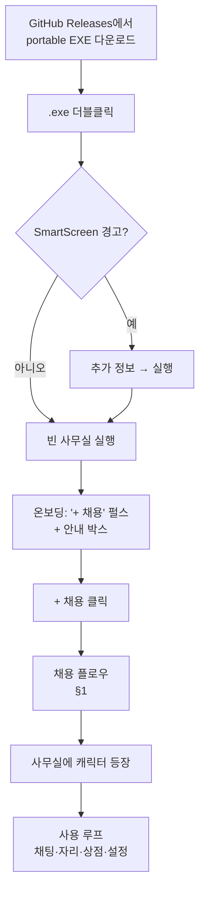
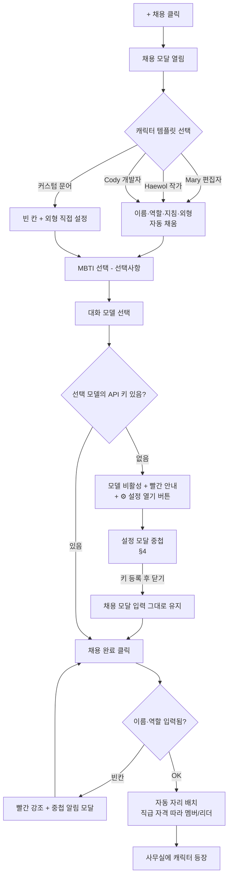
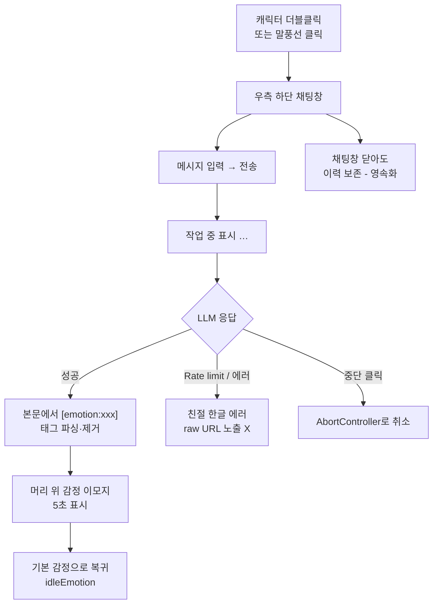
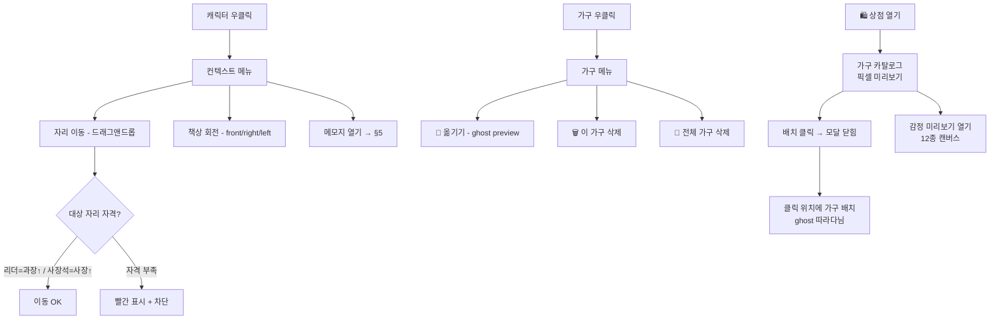
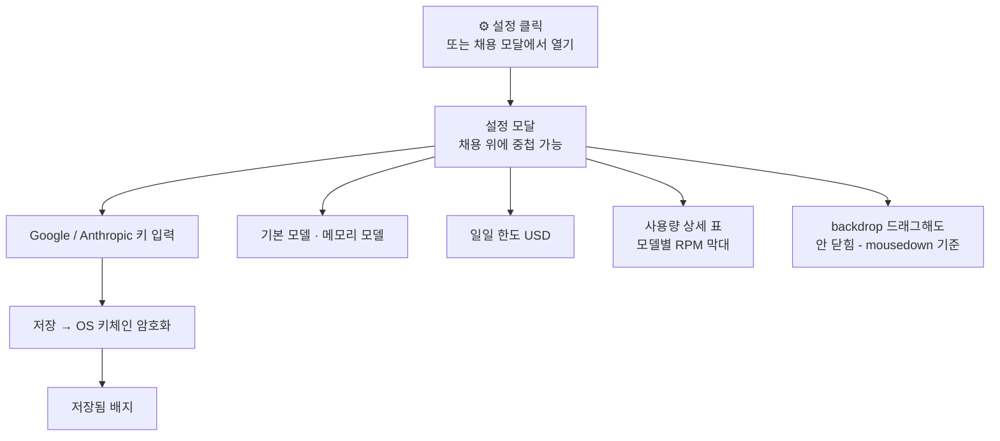
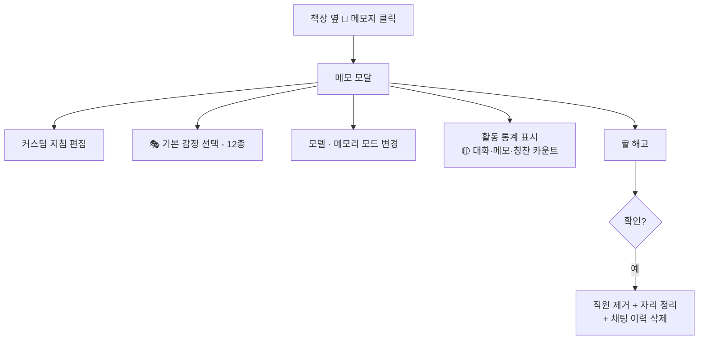
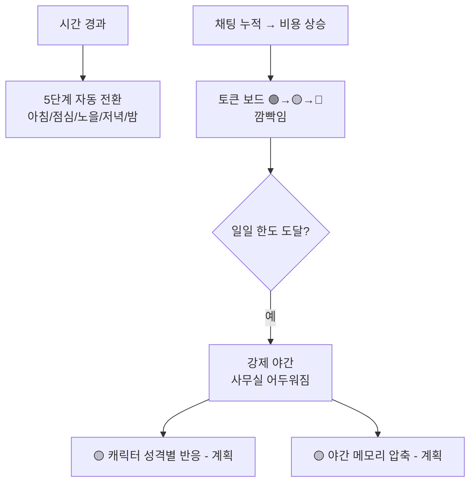

# User Flow — PixelAgentOffice v0.0.1

> 현재 빌드(portable EXE v0.0.1) 기준 사용자 플로우. Day 12까지 구현된 실제 화면·동작 흐름.
> 다이어그램은 GitHub에서 mermaid로 렌더링됨. 범례: 실선=구현됨 / `🟡`=부분구현 / `📋`=계획.

---

## 0. 큰 그림 — 전체 진입 플로우

핵심 전환: **이전 버전은 Mary·Haewol 더미 2명이 미리 있었지만, v0.0.1부터 빈 사무실 시작** → 테스터가 직접 첫 채용을 경험.

---

## 1. 채용 플로우 (HireModal)

**포인트**: 키 없을 때 설정을 열어도 **채용 모달이 닫히지 않고 입력이 보존**됨 (v0.0.1 버그 수정). 알림은 `window.alert`이 아닌 디자인된 중첩 모달.

---

## 2. 채팅 플로우 (감정 시스템)

**system prompt 구성**: 기본 지침 + 커스텀 지침 + MBTI 페르소나 + 감정 태그 지침 + `🟡`메모리(계획) → LLM 전송.

---

## 3. 사무실 인터랙션 (자리·책상·가구)

---

## 4. 설정 플로우 (API 키 · 중첩)

**중첩**: 채용 모달에서 설정을 열면 설정이 zIndex 위로 떠서 중첩 표시 → 키 등록 후 닫으면 채용 입력 유지 (v0.0.1 수정).

---

## 5. 직원 관리 (메모지 · 해고)

---

## 6. 시그니처 — 시간대 · 강제 야간

---

## 7. 미구현/계획 흐름 (정직 표기)

| 흐름 | 상태 |
|---|---|
| 진급 요청 모달 (활동 누적 → 캐릭터가 진급 요청 → 승인) | 🟡 골격만 (카운터 미연결) |
| 메모리 자동 누적·주입 | 🟡 UI만 |
| 칭찬 👍 버튼 → 카운트 | 🟡 미구현 |
| 튜토리얼/온보딩 단계별 가이드 | 📋 테스터 T1 피드백 → 계획 |
| Floor 2 Team Office / Seegene 임포트 | 📋 Phase 2 |

---

**기준 버전**: v0.0.1 (2026-05-26, Day 12)
**관련 문서**: [PRD.md](PRD.md) · [wireframes.html](wireframes.html) · [FEATURES.md](FEATURES.md)
